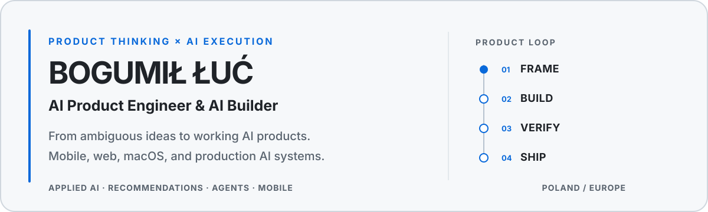
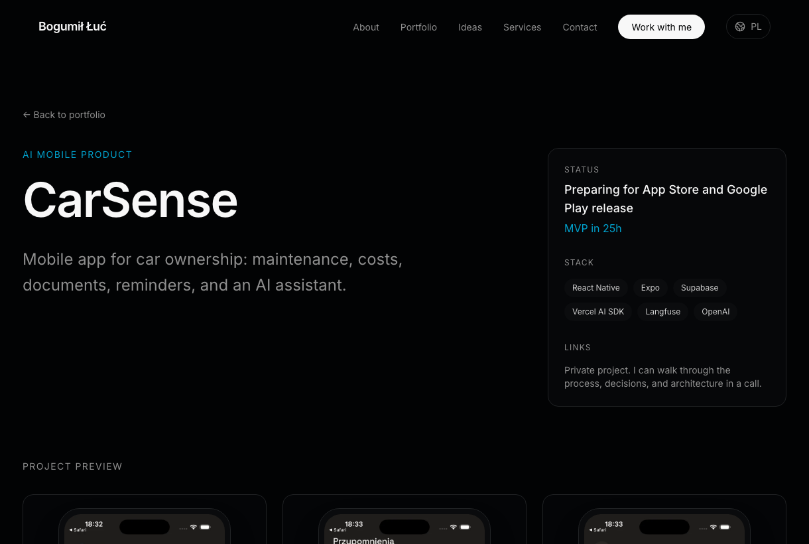
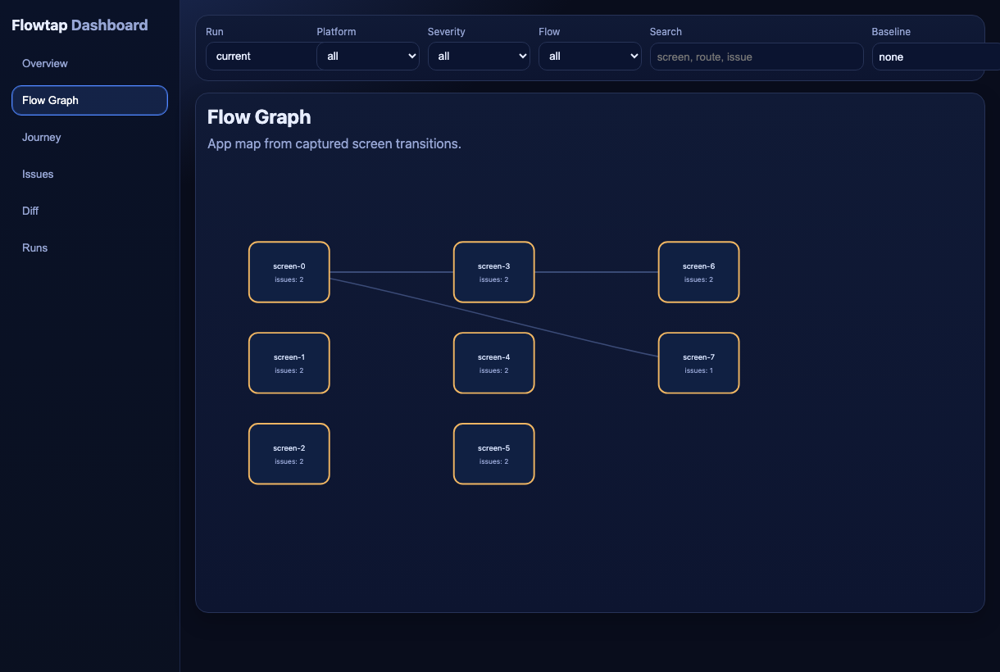
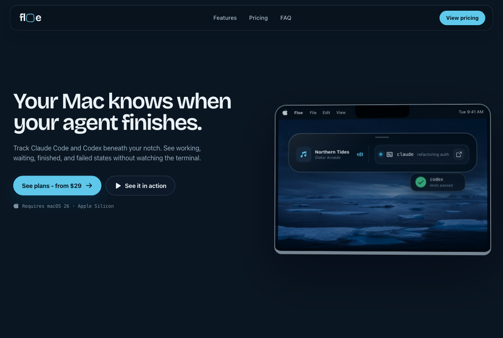

<picture>
  <source media="(prefers-color-scheme: dark) and (max-width: 600px)" srcset="./assets/hero-mobile-dark-v2.svg">
  <source media="(prefers-color-scheme: light) and (max-width: 600px)" srcset="./assets/hero-mobile-light-v2.svg">
  <source media="(prefers-color-scheme: dark)" srcset="./assets/hero-dark.svg">
  <source media="(prefers-color-scheme: light)" srcset="./assets/hero-light.svg">
  
</picture>

  <a href="https://bogumilluc.pl">Portfolio</a>
  ·
  <a href="https://www.linkedin.com/in/bogumilluc/">LinkedIn</a>
  ·
  <a href="mailto:hello@bogumilluc.pl">Email</a>

I lead AI product work from an unclear opportunity to a working mobile, web, or macOS product. Coding agents are part of my implementation layer; I remain responsible for product decisions, system behavior, validation, QA, and final quality.

  <strong>Production AI</strong>
  ·
  <strong>5k+ app downloads</strong>
  ·
  <strong>Mobile · Web · macOS</strong>
   
  Recommendations and AI assistants · 500k+ organic launch views · Product ownership from scope to release

## Production AI

### [Foodify](https://foodify.com)

**Applied AI & Recommendations at INVO**

Led AI product work for a major Polish foodtech platform across mobile and web.

- Delivered an AI assistant supporting meal discovery, personalization, and ordering.
- Built Python-based recommendation and personalization systems around customer preferences and dietary needs.
- Owned AI initiatives from product framing through validation, release, and iteration.

`Applied AI` · `Recommendation Systems` · `Personalization` · `LLM Applications` · `Python`

Implementation details, internal performance, and commercial data remain confidential.

### Confidential Beauty-Tech Platform

**Lead Product Engineering**

I currently lead product engineering for a confidential mobile and web platform used by clients, beauty professionals, and business owners.

- Own product discovery, UX decisions, role-based onboarding and booking flows, implementation, QA, and release.
- Use coding agents as delivery leverage while retaining responsibility for behavior, acceptance criteria, testing, and final quality.

`React Native` · `Expo` · `TypeScript` · `Product Engineering` · `AI-Native Delivery`

The product name, organization, internal architecture, and commercial data remain confidential under NDA.

## Featured Products

### [CarSense: AI-Assisted Vehicle Companion](https://bogumilluc.pl/en/projects/carsense)

A React Native product for iOS and Android that brings vehicle maintenance, costs, documents, reminders, and a context-aware AI assistant into one experience.

I built the first functional version during a 25-hour product sprint, covering the core mobile flows from onboarding to vehicle management. It is now being developed toward a production release.

`React Native` · `Expo` · `TypeScript` · `Supabase` · `Vercel AI SDK` · `OpenAI`

### [FlowTap: Multi-Agent Mobile QA](https://bogumilluc.pl/en/projects/flowtap)

A multi-agent QA system for React Native and Expo applications. FlowTap explores real product flows, executes tests, captures screens, identifies UI and behavioral issues, and turns the findings into actionable reports.

I own the product direction, agent workflows, mobile testing approach, evaluation strategy, and end-to-end delivery.

`AI Agents` · `Multi-Agent Systems` · `React Native` · `Expo` · `Maestro` · `Vision Models`

### Floe: The Living Layer for Your Mac

A commercial macOS product that brings background agent activity, media, files, clipboard actions, and system signals into one contextual surface.

Floe evolves the public cmdFlow foundation into a broader native product. I own product definition, interaction design, implementation workflow, testing, and release direction.

`Native macOS` · `Swift` · `SwiftUI` · `Agent Workflows` · `Product Design`

### Previously Shipped: MemeMatch

I co-founded and released a consumer social app on iOS and Android for meeting people through memes and shared humor.

My work covered product discovery, roadmap, validation, launch, and experiments with AI-assisted meme classification, moderation, search, and recommendations.

**5k+ downloads · ~6k launch leads · 500k+ organic views · 2nd place at KRK Pitch Contest**

[App Store](https://apps.apple.com/pl/app/memematch-randki-znajomi/id6446218299) · [Google Play](https://play.google.com/store/apps/details?id=com.szelemeh.memematch_app)

## Open Source

| Project | What it demonstrates | Stack |
| --- | --- | --- |
| **[Business Ideas](https://github.com/miekki-jerry/business-ideas)** | Source-backed AI knowledge base, search engine, and MCP server with attributable context. | TypeScript, Workers, D1, R2, MCP |
| **[WakeUp Samurai](https://github.com/miekki-jerry/wakeup-samurai)** | Native macOS app with tests, CI, release packaging, and installable DMG releases. | Swift, AppKit, SwiftPM, GitHub Actions |
| **[cmdFlow](https://github.com/miekki-jerry/cmdFlow)** | Native utility using Apple's on-device Foundation Model or optional cloud models. | SwiftUI, FoundationModels, Keychain |

## How I Work

> **Frame → Build → Verify → Ship**
>
> I use coding agents as execution leverage while owning product scope, system behavior, QA, and the final result.

`Python` · `TypeScript` · `React Native` · `Expo` · `Swift` · `Next.js` · `Postgres` · `OpenAI` · `LangGraph` · `MCP`

## Let's Build Something Useful

Looking for an AI Product Engineer who can turn an unclear opportunity into a working product?

[View selected work](https://bogumilluc.pl) · [Connect on LinkedIn](https://www.linkedin.com/in/bogumilluc/) · [Email me](mailto:hello@bogumilluc.pl)
